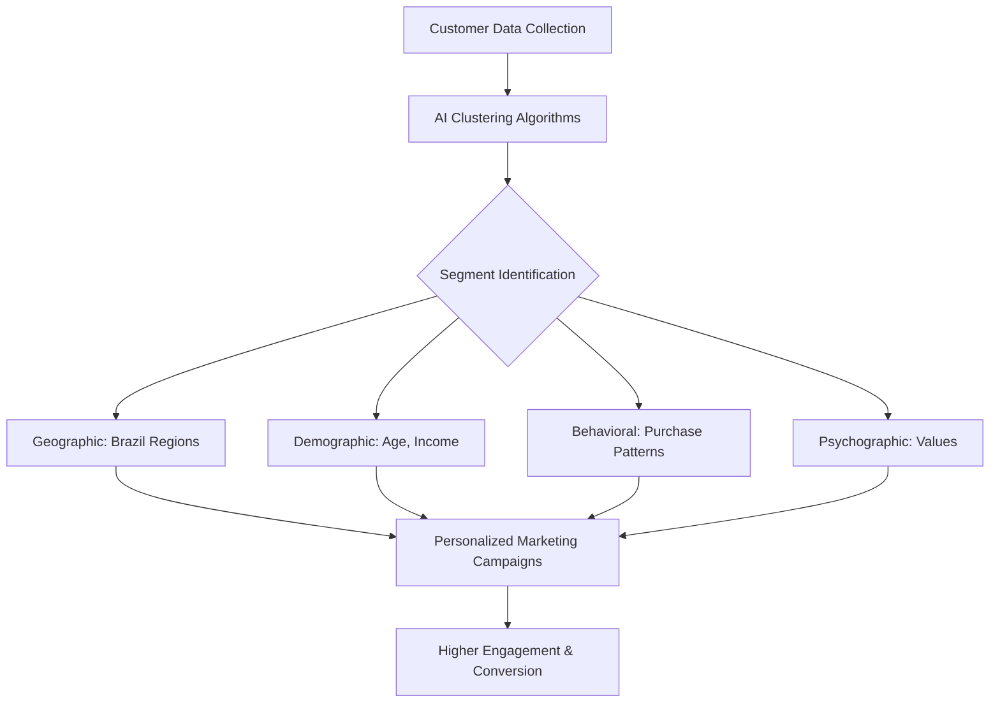
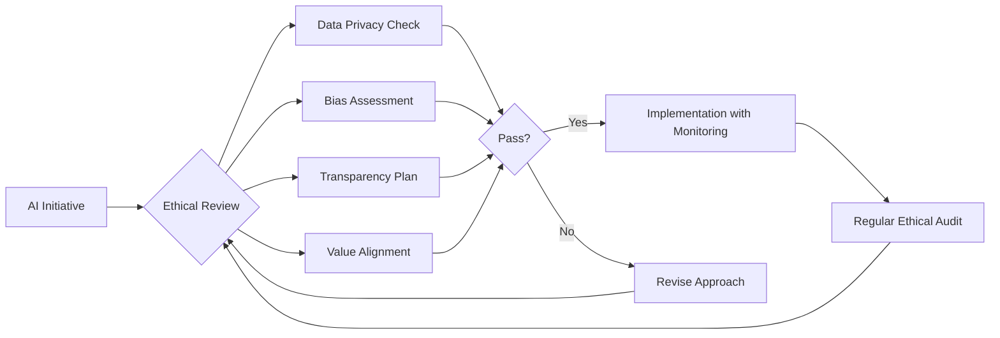

# How AI Can Help a Marketing Company

## A Guide for DMC Propaganda: AI-Driven Strategies for Ethical Brazilian Marketing

**April 2025**

---

## Table of Contents

1. [Introduction](#introduction)
2. [AI-Driven Marketing Strategies](#ai-driven-marketing-strategies)
3. [Ethical AI Implementation](#ethical-ai-implementation)
4. [Metrics and KPIs for AI Marketing](#metrics-and-kpis-for-ai-marketing)
5. [Case Studies for Brazilian Market](#case-studies-for-brazilian-market)
6. [Implementation Roadmap](#implementation-roadmap)
7. [ROI Calculations](#roi-calculations)
8. [Future Trends](#future-trends)
9. [Resources & Tools](#resources-and-tools)

---

## Introduction

Artificial Intelligence is revolutionizing marketing globally, with unique applications and opportunities in Brazil's diverse and dynamic market. This guide outlines how DMC Propaganda can leverage AI technologies to enhance marketing efficiency, creativity, and results while maintaining an ethical approach that respects Brazilian culture and values.

### Why AI for Marketing in Brazil?

- **Market Size Opportunity**: Brazil has over 150 million internet users and 140 million social media users (2025)
- **Digital Transformation**: COVID-19 accelerated digital adoption across all demographics
- **Competitive Advantage**: Only 32% of Brazilian marketing agencies effectively utilize AI (2024 ABAP study)
- **Cultural Relevance**: AI can help navigate Brazil's regional differences and create more targeted campaigns

---

## AI-Driven Marketing Strategies

### 1. Enhanced Customer Segmentation & Personalization



**Implementation for DMC Propaganda:**
- Deploy machine learning clustering to identify micro-segments within Brazilian market
- Create dynamic content that adapts to cultural nuances across Brazil's five regions
- Develop personalized funnels based on predictive customer journey mapping

### 2. Predictive Analytics for Campaign Optimization

**Key Applications:**
- **Pre-launch Testing**: Use AI to predict campaign performance before full deployment
- **Budget Allocation**: Optimize media spend across traditional and digital channels
- **Trend Forecasting**: Identify emerging trends specific to Brazilian consumers
- **Churn Prediction**: Identify at-risk clients and implement retention strategies

**Example: AI-Powered Media Mix Modeling**

| Channel | Traditional Allocation | AI-Optimized Allocation | Performance Increase |
|---------|-------------------------|--------------------------|----------------------|
| Digital | 45% | 52% | +22% ROI |
| TV | 30% | 23% | +5% Cost Efficiency |
| OOH | 15% | 12% | +8% Targeted Reach |
| Radio | 10% | 13% | +18% Local Engagement |

### 3. Content Generation & Creative Enhancement

**Applications in the Brazilian Context:**
- Portuguese-language copywriting with regional dialect sensitivity
- Cultural reference integration for more authentic messaging
- Visual content generation adapting to Brazilian aesthetic preferences
- Voice and audio content optimized for Brazilian Portuguese

**Ethical AI-Generated Content Process:**

1. Human brief with cultural context → 
2. AI content generation → 
3. Human review and enhancement → 
4. Cultural sensitivity check → 
5. A/B testing → 
6. Optimization

### 4. Conversational Marketing & Advanced Chatbots

**Brazilian Market Considerations:**
- Build NLP models specifically trained on Brazilian Portuguese
- Include colloquialisms and regional expressions in chatbot training
- Design conversation flows that align with Brazilian communication styles
- Integrate with popular Brazilian messaging platforms (WhatsApp has 98% penetration)

**Potential Applications:**
- Customer service automation
- Lead qualification
- Product recommendations
- Contest and promotion management

### 5. Sentiment Analysis & Real-time Market Intelligence

**Benefits for Brazilian Campaigns:**
- Monitor social media conversations around campaigns in real-time
- Track Brazilian consumer perception of brands during major events (Carnaval, World Cup)
- Identify regional differences in campaign reception
- Detect potential PR issues before they escalate

---

## Ethical AI Implementation

### Core Principles for DMC Propaganda

1. **Transparency**: Always disclose AI use to clients and consumers when applicable
2. **Data Privacy Compliance**: Adhere to LGPD (Brazil's General Data Protection Law)
3. **Human Oversight**: Maintain human review processes for AI-generated content
4. **Bias Prevention**: Regularly audit algorithms for potential bias, especially considering Brazil's diverse population
5. **Value Alignment**: Ensure AI applications align with client and Brazilian cultural values

### Ethical Framework Implementation



---

## Metrics and KPIs for AI Marketing

### Performance Metrics Framework

| Category | Key Metrics | AI Enhancement |
|----------|------------|----------------|
| **Campaign Performance** | • Conversion Rate<br>• ROAS<br>• Engagement Rate<br>• CPM/CPC/CPA | • Predictive pre-campaign performance<br>• Automated optimization<br>• Real-time adjustment |
| **Customer Insights** | • Customer Lifetime Value<br>• Churn Rate<br>• Segment Growth<br>• Brand Perception | • Predictive LTV<br>• Churn prevention<br>• Automated segment discovery |
| **Content Effectiveness** | • Content Engagement<br>• Message Resonance<br>• A/B Test Results<br>• Creative Fatigue Rate | • Content performance prediction<br>• Semantic content analysis<br>• Creative variation generation |
| **Operational Efficiency** | • Campaign Build Time<br>• Client Onboarding Time<br>• Resource Utilization<br>• Research Time Reduction | • Workflow automation<br>• Process optimization<br>• Automated reporting |

### Visualization: AI Impact on Marketing KPIs

```
🔹 Campaign Performance Before AI
▲ Campaign Performance After AI

ROI          🔹------------▲---------------------
Conversion   🔹-----------▲----------------------
Engagement   🔹----------------▲-----------------
Efficiency   🔹---------------------▲------------
Retention    🔹--------------▲-------------------
Insight Gen  🔹------------------------▲---------
              0%   20%   40%   60%   80%   100% 
                       Improvement %
```

---

## Case Studies for Brazilian Market

### Case Study 1: AI-Driven Regional Personalization

**Client:** Major Brazilian Retailer  
**Challenge:** Diverse regional preferences across Brazil's five regions  
**AI Solution:** Machine learning-based market segmentation with regional content adaptation  
**Results:**
- 34% increase in campaign engagement in Northeast region
- 28% higher conversion rates in South region
- 42% improvement in customer retention in North region

### Case Study 2: Predictive Budget Allocation

**Client:** Brazilian FMCG Brand  
**Challenge:** Limited marketing budget with pressure to improve ROAS  
**AI Solution:** Predictive analytics for cross-channel budget optimization  
**Results:**
- 27% increase in ROAS
- 18% reduction in customer acquisition costs
- Identified underperforming channels, reallocating 35% of budget

### Case Study 3: AI Content Generation for Multicultural Campaigns

**Client:** Tourism Board  
**Challenge:** Creating relevant content for diverse international markets  
**AI Solution:** Culture-adaptive content generation system  
**Results:**
- 300% increase in content production capacity
- 52% higher engagement from international visitors
- 23% improvement in conversion rates from targeted markets

---

## Implementation Roadmap

### Phase 1: Foundation (Months 1-3)
- AI readiness assessment
- Data infrastructure setup
- Team training and capability building
- Initial use case identification
- Ethical framework development

### Phase 2: Pilot Implementation (Months 4-6)
- Deploy AI tools for 2-3 selected use cases
- Establish measurement frameworks
- Client education and onboarding
- Feedback collection and evaluation
- Process refinement

### Phase 3: Scaling (Months 7-12)
- Expand AI implementation across departments
- Integration with existing workflow systems
- Advanced team training
- Case study development
- ROI measurement and reporting

### Phase 4: Innovation (Months 13+)
- Custom AI solution development
- AI-driven service offering expansion
- Thought leadership positioning
- Industry partnership development
- Continuous learning systems implementation

---

## ROI Calculations

### Investment Requirements

| Category | Initial Investment (R$) | Ongoing Monthly (R$) |
|----------|--------------------------|----------------------|
| AI Software & Tools | 180,000 - 350,000 | 15,000 - 30,000 |
| Team Training | 50,000 - 120,000 | 5,000 - 15,000 |
| Data Infrastructure | 100,000 - 250,000 | 8,000 - 20,000 |
| Consulting Support | 75,000 - 200,000 | 0 - 50,000 |
| **Total** | **405,000 - 920,000** | **28,000 - 115,000** |

### Expected Returns

| Benefit Category | Year 1 | Year 2 | Year 3 |
|------------------|--------|--------|--------|
| Efficiency Gains | +15-20% | +25-35% | +40-50% |
| Revenue Increase from AI-Enhanced Campaigns | +10-15% | +18-25% | +25-35% |
| Client Retention Improvement | +5-10% | +10-20% | +15-25% |
| New Business from AI Capabilities | +8-15% | +15-25% | +20-30% |
| **Total Revenue Impact** | **+12-18%** | **+20-30%** | **+30-40%** |

### ROI Timeline Projection

```
                                 Break-Even Point
                                       |
Investment                            |
& Return (R$)                         v
  ^                              ........................
  |                          .../
  |                      ..../
  |                  ..../                      Returns
  |              ..../
  |          ..../
  |      ..../                        
  |  ..../
  |./
  +------------------------------------------>
     Q1   Q2   Q3   Q4   Q1   Q2   Q3   Q4    Time
    |------ Year 1 ------|------ Year 2 ------|
```

---

## Future Trends

### Emerging AI Technologies for Marketing in Brazil

1. **Hyper-Personalization**
   - Individual-level content customization
   - Real-time adaptation based on context
   - Emotion-aware marketing

2. **Immersive Experiences**
   - AI-generated AR/VR content
   - Synthetic media for experiential marketing
   - Virtual brand ambassadors

3. **Predictive Customer Journeys**
   - Next-best-action recommendations
   - Preemptive customer service
   - Individual-level funnel optimization

4. **Voice & Visual Search Optimization**
   - Brazilian Portuguese voice search optimization
   - Visual content tagging for discovery
   - Multi-modal search strategy

5. **Edge AI for Privacy-First Marketing**
   - On-device personalization
   - Federated learning implementations
   - Privacy-preserving analytics

---

## Resources and Tools

### Recommended AI Marketing Tools

| Category | Tools | Application |
|----------|-------|-------------|
| **Customer Analytics** | • IBM Watson Customer Insights<br>• Amplitude<br>• Mixpanel<br>• Adobe Analytics | Customer segmentation and behavior analysis |
| **Content Generation** | • ChatGPT (Portuguese-trained)<br>• Jasper<br>• DALL-E 3<br>• Midjourney | Copy, image, and video creation |
| **Campaign Optimization** | • Albert<br>• Adext<br>• Pattern89<br>• Twik | Automated campaign improvement |
| **Predictive Analytics** | • Faraday<br>• MRP (Market Reasoning Platform)<br>• Pecan AI<br>• RapidMiner | Future performance forecasting |
| **Conversation AI** | • BotCity (Brazilian)<br>• Take Blip (Brazilian)<br>• IBM Watson Assistant<br>• Drift | Chatbots and conversational marketing |

### Brazilian AI Marketing Resources

- [Brazilian Association of Digital Agencies (ABRADi)](https://abradi.com.br/)
- [IAB Brazil](https://iabbrasil.com.br/)
- [Data Protection Brazil Report](https://www.dataprivacybr.org/)
- [AI Hub Brazil](https://www.hub.iai.org.br/)
- [FGV's Center for AI & Digital Policy Studies](https://portal.fgv.br/)

---

## Next Steps for DMC Propaganda

1. **Conduct an AI readiness assessment**  
   Evaluate current capabilities, infrastructure, and skill gaps

2. **Identify high-impact, low-effort AI use cases**  
   Begin with projects that can demonstrate quick wins

3. **Develop an ethical AI framework**  
   Create guidelines specific to DMC Propaganda's values and Brazilian context

4. **Initiate team training programs**  
   Build internal capabilities for AI implementation and management

5. **Engage with technology partners**  
   Identify potential vendors and consultants for implementation support

---

*This guide was created specifically for DMC Propaganda, taking into account the Brazilian marketing landscape and ethical considerations for AI implementation in 2025.*